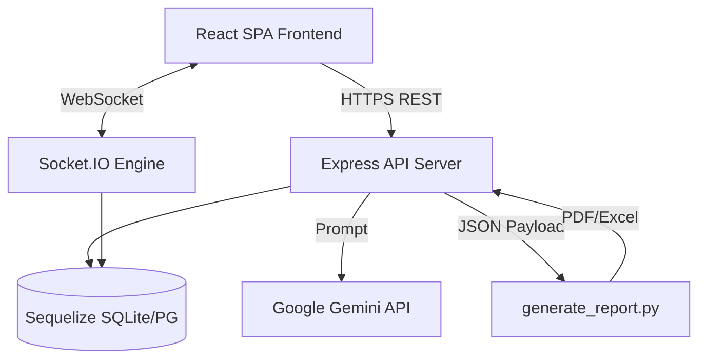
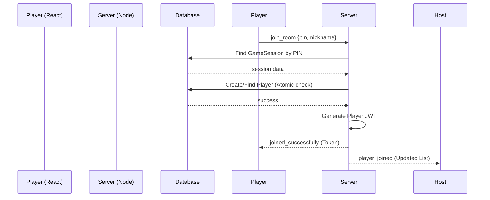
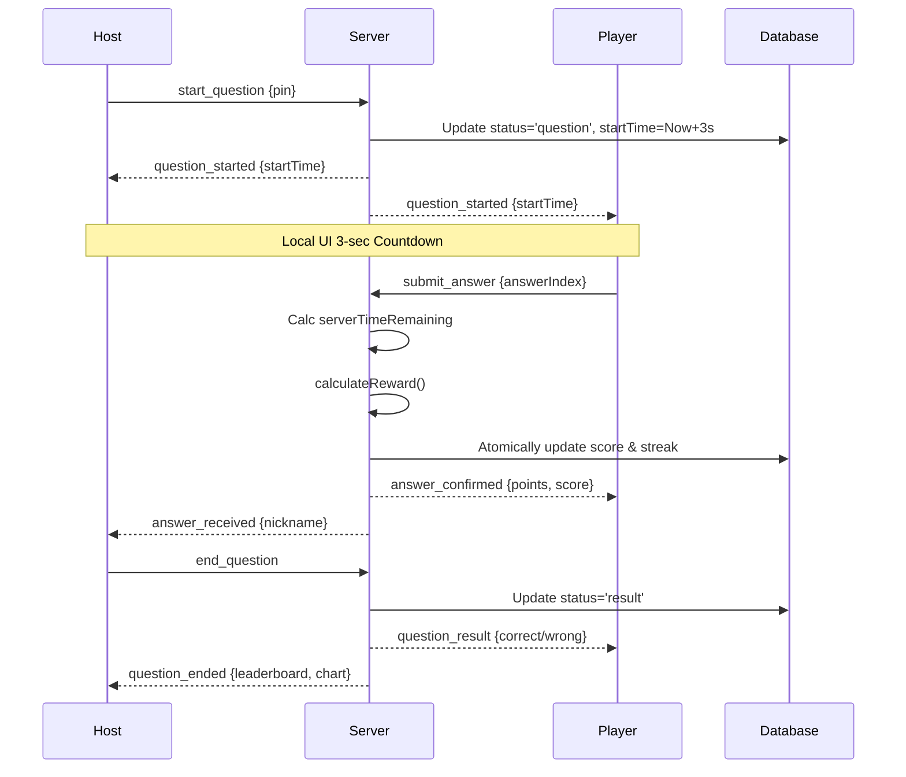

# Kahoot Awareness - Complete Project Documentation

## Table of Contents
- [1. High-Level Overview](#1-high-level-overview)
- [2. Complete Technology Stack](#2-complete-technology-stack)
- [3. Complete Folder Structure](#3-complete-folder-structure)
- [4. Architecture and Responsibility](#4-architecture-and-responsibility)
- [5. Complete Feature Inventory](#5-complete-feature-inventory)
- [6. User Flows](#6-user-flows)
- [7. Session Management System](#7-session-management-system)
- [8. Authentication and Authorization](#8-authentication-and-authorization)
- [9. QR Code Implementation](#9-qr-code-implementation)
- [10. Timer Implementation](#10-timer-implementation)
- [11. Sound System](#11-sound-system)
- [12. Animations and Transitions](#12-animations-and-transitions)
- [13. Complete Scoring Engine](#13-complete-scoring-engine)
- [14. Reports Generation](#14-reports-generation)
- [15. API Endpoints](#15-api-endpoints)
- [16. Database Models](#16-database-models)
- [17. State Management](#17-state-management)
- [18. Socket Events](#18-socket-events)
- [19. Race Conditions Handling](#19-race-conditions-handling)
- [20. Resilience and Failure Handling](#20-resilience-and-failure-handling)
- [21. Routing](#21-routing)
- [22. Configuration Management](#22-configuration-management)
- [23. Utilities, Helpers, and Hooks](#23-utilities-helpers-and-hooks)
- [24. Architecture Diagrams](#24-architecture-diagrams)
- [25. Developer Guide](#25-developer-guide)

---

## 1. High-Level Overview

**Project Name**: Kahoot Awareness (Quizmoto)
**Purpose**: An interactive, real-time multiplayer quiz application inspired by Kahoot! It allows a host to create quizzes, launch live sessions, and invite players via a 6-digit PIN or a dynamically generated QR Code. The application supports individual and team-based gameplay modes, real-time leaderboards, point modifiers based on answer speed and streaks, sound and visual effects, and post-game analytical reports.
**Target Users**: 
- **Hosts (Teachers, Presenters, Event Organizers)**: Users who can create content (quizzes), manage active game sessions, control game pacing, and analyze student/player performance post-game.
- **Players (Students, Attendees)**: Users who join active sessions from their own devices to participate, submit answers interactively, and compete for leaderboard spots.

**Architecture Synopsis**: 
The system employs a client-server architecture. The frontend is a Single Page Application (SPA) built using React.js and Vite. The backend is a monolithic Node.js and Express application that serves REST APIs for CRUD operations and authentication, whilst utilizing Socket.IO for real-time bidirectional event-based communication. The application utilizes an ORM (Sequelize) to allow persistence across various SQL dialects (currently utilizing SQLite/PostgreSQL/MySQL), and delegates complex, computationally heavy report generation to a dedicated Python script. AI integration via Google's Gemini LLM enables auto-generation of quiz content.

---

## 2. Complete Technology Stack

### Frontend
- **Framework**: React.js (v19.2.0) - UI library.
- **Build Tool**: Vite (v7.3.1) - Fast bundler and development server.
- **Routing**: React Router DOM (v7.13.0) - Client-side routing.
- **Styling**: Tailwind CSS (v4.2.0) - Utility-first CSS framework.
- **State Management**: React Context API (`AuthContext`, `SocketContext`) combined with local component state.
- **Real-time Communication**: `socket.io-client` (v4.8.3) - WebSocket client.
- **Animations & Graphics**:
  - `framer-motion` (v12.34.3) - For UI transitions and micro-animations.
  - `canvas-confetti` (v1.9.4) - For victory/celebration screens.
  - `lucide-react` (v0.575.0) - Icon library.
- **QR Code Generation**: `qrcode.react` (v4.2.0) - Rendering SVG/Canvas QR Codes.
- **Authentication**: `@react-oauth/google` (v0.13.5) - Google Identity Services integration.
- **HTTP Client**: `axios` (v1.13.5) - For REST API requests.

### Backend
- **Framework**: Node.js with Express.js (v5.2.1) - Server environment and web framework.
- **Real-time Communication**: `socket.io` (v4.8.3) - WebSocket server.
  - `@socket.io/redis-adapter` (v8.3.0) & `redis` (v4.7.0) - Optional adapter for horizontal scaling.
- **Database & ORM**:
  - **ORM**: Sequelize (v6.37.7) - SQL ORM.
  - **Drivers**: `sqlite3`, `pg` (PostgreSQL), `mysql2` - Supported database drivers.
- **Authentication & Security**:
  - `jsonwebtoken` (v9.0.3) - JWT generation and verification.
  - `bcryptjs` (v3.0.3) - Password hashing.
  - `google-auth-library` (v11.0.0) - Server-side verification of Google OAuth tokens.
  - `cors` (v2.8.6) - Cross-Origin Resource Sharing.
  - `helmet` (v8.1.0) - Securing HTTP headers.
  - `express-rate-limit` (v8.2.1) - Brute-force protection.
- **Data Validation**: `joi` (v18.0.2) - Schema validation for incoming API requests.
- **Environment Management**: `dotenv` (v17.3.1) - Parsing `.env` files.
- **Third-Party Services**:
  - Google Gemini API (`@google/generative-ai`): AI-assisted quiz creation.
- **Auxiliary Scripts**: Python 3 (for `detailed_report.py` and `generate_report.py`) - Utilized for generating downloadable PDF and Excel analytics reports, spawned via child processes.

### Deployment & Infrastructure
- **Hosting**: Currently deployed on **Render (Free Tier)**. To circumvent the free tier's inactivity sleep limit, the Node.js backend implements an internal 14-minute keep-alive ping to its own `/health` endpoint.
- **Containerization**: Docker & Docker Compose - Isolated environment setups for Nginx, Backend, and Frontend.
- **Web Server / Reverse Proxy**: Nginx (via `automate_nginx.sh`) - Used to route frontend and backend traffic on port 80/443.
- **Package Manager**: npm.

---

## 3. Complete Folder Structure

```
c:\kahoot-awareness\
├── .agent/                             # Agent workflows (e.g., deployment guides)
├── .env                                # Environment variables (ignored in Git)
├── client/                             # Frontend React Application
│   ├── index.html                      # Entry HTML file
│   ├── package.json                    # Frontend dependencies and scripts
│   ├── tailwind.config.js              # Tailwind styling configuration
│   ├── vite.config.js                  # Vite bundler configuration
│   ├── public/                         # Static assets (images, sounds)
│   └── src/                            # React Source Code
│       ├── App.jsx                     # Main React Application router & layout
│       ├── main.jsx                    # React entry point
│       ├── config.js                   # Client-side configuration (Backend URL)
│       ├── index.css                   # Global CSS and Tailwind directives
│       ├── components/                 # Reusable UI components
│       │   ├── AvatarDisplay.jsx       # Renders user avatars
│       │   ├── ReactionBar.jsx         # UI for players to send live emojis
│       │   └── ReactionCanvas.jsx      # UI for displaying flying emojis over the game
│       ├── context/                    # React Context Providers
│       │   ├── AuthContext.jsx         # Manages Host and Player JWT authentication state
│       │   └── SocketContext.jsx       # Provides global Socket.IO instance
│       ├── hooks/                      # Custom React Hooks
│       ├── pages/                      # Route-level components
│       │   ├── Home.jsx                # Landing page
│       │   ├── Host/                   # Host-specific views
│       │   │   ├── Login.jsx           # Host Google/Email authentication
│       │   │   ├── Dashboard.jsx       # Host quiz management
│       │   │   ├── CreateQuiz.jsx      # UI for manual and AI quiz generation
│       │   │   ├── EditQuiz.jsx        # UI for updating an existing quiz
│       │   │   ├── Reports.jsx         # View and download past game analytics
│       │   │   ├── Lobby.jsx           # Host game lobby (shows PIN, QR, joined players)
│       │   │   └── GameView.jsx        # Host active game view (questions, leaderboard)
│       │   └── Player/                 # Player-specific views
│       │       ├── Join.jsx            # Enter PIN to join game
│       │       ├── PlayerLogin.jsx     # Optional player persistent authentication
│       │       ├── PlayerDashboard.jsx # Player profile and match history
│       │       ├── PlayerLobby.jsx     # Waiting room for players
│       │       └── PlayerGame.jsx      # Player active game view (answer buttons)
│       ├── services/                   # API interaction layer
│       └── utils/                      # Helper utilities
│           ├── audio.js                # Legacy audio helper
│           └── audioEngine.js          # Advanced audio engine for sounds (caching, overlap, muting)
├── server/                             # Backend Node.js Application
│   ├── index.js                        # Main Express application entry point (Server setup, socket init)
│   ├── package.json                    # Backend dependencies and scripts
│   ├── Dockerfile                      # Backend container configuration
│   ├── config/                         # Database and environment configurations
│   │   └── database.js                 # Sequelize connection initialization
│   ├── models/                         # Sequelize ORM Models
│   │   ├── GameSession.js              # GameSession, Player, and PlayerAnswer schemas
│   │   ├── PlayerProfile.js            # Persistent player account schema (XP, levels)
│   │   ├── Quiz.js                     # Quiz and Question schemas
│   │   └── User.js                     # Host account schema
│   ├── routes/                         # Express REST API routes
│   │   ├── auth.js                     # Host authentication endpoints (Google/JWT)
│   │   ├── middleware.js               # JWT verification middleware
│   │   ├── playerAuth.js               # Player authentication and profile endpoints
│   │   └── quizzes.js                  # Quiz CRUD, AI generation, and Report generation endpoints
│   ├── services/                       # Business logic and real-time handlers
│   │   └── socketHandlers.js           # The core Socket.IO event processing engine
│   └── utils/                          # Server-side utilities
│       ├── generate_report.py          # Python script invoked by Node to create PDF/Excel reports
│       └── seedData.js                 # Default quizzes for initialization
├── docker-compose.yml                  # Production Docker Compose orchestration
├── docker-compose.local.yml            # Local development Docker Compose orchestration
└── DOCKER_ARCHITECTURE_AND_FREE_HOSTING.md # Deployment documentation
```

---

## 4. Architecture and Responsibility

The system follows a separated frontend-backend architecture.

### 4.1 Frontend (React)
The frontend is responsible for the user interface, navigation, local state handling, and rendering real-time updates.
- **Routing**: `react-router-dom` segregates views into Host paths (protected) and Player paths (public/persistent).
- **Socket Handling**: The `SocketContext` instantiates a singleton WebSocket connection globally. Components emit and listen to events (e.g., `answer_received`, `question_started`).
- **Context API**: `AuthContext` determines if the user is a logged-in Host or a persistent Player, managing tokens in `localStorage`.
- **Audio Engine**: `audioEngine.js` preloads assets (`tick.wav`, `playful.wav`, etc.) and manages sound playback independently from the React render cycle, mitigating overlapping glitches.

### 4.2 Backend (Node.js/Express)
The backend is responsible for persistence, security, and game state orchestration.
- **REST APIs**: Handle stateless operations like User creation, Quiz authoring, AI Generation, and fetching historical reports.
- **WebSockets (`socketHandlers.js`)**: The "Brain" of the real-time application. It handles state transitions (Lobby -> Question -> Result -> Finished), computes scores, applies streak multipliers, prevents duplicate answers via atomic transactions, and synchronizes state between the host and multiple clients.
- **Database**: SQLite/Postgres stores structural data. The ORM creates strict relations (`Quiz` hasMany `Question`, `GameSession` hasMany `Player`).
- **Child Processes**: Offloads intensive report generation (PDF/Excel creation) to a Python script (`generate_report.py`) to prevent blocking the Node.js event loop.

---

## 5. Complete Feature Inventory

1. **Host Authentication**: Register and login via Email/Password or Google OAuth.
2. **Quiz Management**: Hosts can Create, Edit, Delete, and List quizzes.
3. **AI Quiz Generation**: Automatically create full quizzes by providing a single topic prompt (via Google Gemini AI).
4. **Game Session Initialization**: Host launches a quiz, generating a unique 6-digit PIN.
5. **QR Code Joining**: Players can scan a dynamically generated QR Code in the Host's lobby to join instantly without typing the PIN.
6. **Guest & Persistent Player Joining**: Players can join anonymously or log in via Google to save XP, level up, and track history.
7. **Lobby System**: Real-time lobby showing player count, joined nicknames, avatars, and teams.
8. **Live Reactions**: Players can tap emoji buttons (e.g., ❤️, 😂) which fly across the Host's screen in real-time.
9. **Game Modes**: Classic (Free-for-all) and Team mode (scores aggregated by `teamName`).
10. **Synchronized Timers**: Server dictates exact timestamps. Frontend calculates delta to prevent client-side cheating or drift.
11. **Dynamic Scoring Engine**: Points calculated based on answer correctness, time remaining (faster = more points), and consecutive streaks (x1.2, x1.5, x2.0 multipliers).
12. **Real-time Leaderboard**: Top 5 players displayed after every question, alongside an answer distribution chart.
13. **Audio Experience**: Background music, countdown ticks, correct/incorrect sound effects, and lobby waiting music.
14. **State Recovery (Reconnection)**: If a host or player refreshes the page or loses network, the server detects the reconnection and instantly re-transmits the exact current game state (including active timers).
15. **Post-Game Analytics Engine**: At the end of a session, the server computes Class Analytics (average accuracy), Question Analytics (identifying hard questions), and Student Analytics.
16. **Report Export**: Hosts can download comprehensive analytics reports as PDF or Excel files.
17. **Player Dashboard & History**: Logged-in players have a dashboard displaying their avatar, current level, total XP, and a detailed breakdown of all past games and chosen answers.
18. **Multi-device Session Prevention**: The server binds sockets to Player records to handle "duplicate joins" safely.

---

## 6. User Flows

### 6.1 Host Creates a Session
1. Host logs in and navigates to the Dashboard.
2. Host clicks "Host" on a specific Quiz.
3. Frontend calls `POST /api/quizzes/:id/start`.
4. Backend verifies ownership, generates a unique 6-digit `pin`, creates a `GameSession` with status `lobby`, and returns the PIN.
5. Frontend redirects Host to `/host/lobby/:pin`.
6. Host component mounts, connects to Socket.IO, and emits `join_room` with `role="host"`.
7. Backend adds the Host to the socket room `pin` and a special `host_<pin>` room.

### 6.2 Player Joins using a QR Code or Session Code
1. Player navigates to `/join` and enters the PIN (or arrives via a QR Code URL which auto-fills the PIN).
2. Player enters a nickname (and optionally team name).
3. Player clicks "Join Game".
4. Frontend connects to Socket.IO, emits `join_room` with `role="player"`, `pin`, `nickname`, and optional `playerProfileToken` (if logged in).
5. Backend verifies the session exists and is in `lobby` or active.
6. Backend checks if the nickname is taken. If not, it creates a `Player` record associated with the `GameSession` and generates a persistent JWT `token` for this specific session.
7. Backend emits `player_joined` to the room (Host UI updates).
8. Backend emits `joined_successfully` to the specific Player socket.
9. Frontend saves the session token in context/local storage and navigates to `/player/lobby` or `/player/game` (depending on current session state).

### 6.3 Player Login Process and Dashboard
1. Player navigates to `/player/login` and clicks "Sign in with Google".
2. `@react-oauth/google` provides a Google credential token.
3. Frontend sends `POST /api/player/google` with the credential.
4. Backend verifies the token via `google-auth-library`.
5. Backend finds or creates a `PlayerProfile`, generating a `playerId` JWT.
6. Frontend stores token in `localStorage`, updates `AuthContext`, and redirects to `/player/dashboard`.
7. Frontend fetches `/api/player/profile` and `/api/player/history` to display XP, level, and past match results.

### 6.4 Quiz Gameplay Flow (Question & Answering)
1. **Start**: Host clicks "Start" or "Next Question" in the UI.
2. **Emit**: Host emits `start_question`.
3. **Backend validation**: Backend checks host token, verifies session isn't already on a question to prevent rapid-clicking race conditions.
4. **State Update**: Backend increments `currentQuestionIndex`, sets status to `question`, and sets `questionStartTime` to `Date.now() + 3000` (3 seconds in future).
5. **Broadcast**: Backend emits `question_started` with question data (text, options, timers, `startTime`).
6. **Frontend Countdown**: Both Host and Player UIs see a 3-second visual countdown (Ready? Set. Go!).
7. **Frontend Timer**: Once countdown finishes, the main question timer begins. Player UI shows answer buttons.
8. **Answer Submission**: Player taps an answer. Frontend emits `submit_answer` with the `answerIndex`.
9. **Backend Processing**: 
   - Backend calculates remaining time based on server timestamps.
   - Calculates score reward (points = `1000 + (timeLeft * 10)` * `streakMultiplier`).
   - Atomically updates the `Player` database row (updates score, streak, records `lastAnswerIndex`).
   - Inserts a record into `PlayerAnswer` for historical reporting.
10. **Acknowledge**: Backend emits `answer_confirmed` back to the player, and `answer_received` to the host.
11. **Timeout/End**: When the timer hits 0 (or host skips), Host emits `end_question`.
12. **Result Broadcast**: Backend sets status to `result`. Emits `question_result` individually to players (correct/wrong) and `question_ended` to the Host (leaderboard data, answer distribution).

### 6.5 Report Generation and Download Flow
1. Host clicks "End Game" -> backend sets status to `finished` and computes deep analytics, storing them in `GameSession.analytics`.
2. Host navigates to Reports page and clicks "Download PDF".
3. Frontend calls `GET /api/quizzes/reports/:id/export?format=pdf`.
4. Backend retrieves the full session, players, and answers from DB.
5. Backend dumps this data into a temporary JSON file (`tmp/report_<id>.json`).
6. Backend executes a Python child process (`python3 generate_report.py <json_file> <output_file> pdf`).
7. Python parses JSON, generates charts/PDF using Pandas/Matplotlib/ReportLab.
8. Backend streams the resulting PDF to the client via `res.download`.
9. Backend cleans up temp JSON and PDF files.

### 6.6 Reconnection Flow (Network Loss / Page Refresh)
1. Player refreshes page -> React state is lost.
2. `App.jsx` mounts, `SocketContext` establishes a new Socket connection (new `socket.id`).
3. Player component reads the active session JWT from `localStorage`.
4. Component emits `join_room` with `token`.
5. Backend verifies the token. Recognizes the player (`isReentry = true`).
6. Backend updates the `Player` DB record with the new `socket.id`.
7. Backend observes that the `GameSession` is currently in the `question` status.
8. Backend compiles a `session_info` payload containing current question text, options, exact server timestamp, `score`, and `answered` status.
9. Backend emits `session_info` to the Player.
10. Player UI instantly snaps back into the game, disabling buttons if they already answered, and syncing the timer perfectly.

---

## 7. Session Management System

The session system ensures consistency between stateless REST APIs and stateful WebSockets.

**Session Identifiers**:
- `pin`: A 6-digit unique string used as the human-readable identifier and the Socket.IO room name.
- `sessionId`: Database primary key.

**Session Lifecycle**:
1. **Creation**: `status = 'lobby'`. Hosted by a specific `userId`.
2. **Progression**: Toggles between `question` and `result` statuses as `currentQuestionIndex` increments.
3. **Termination**: Host triggers `end_game`, setting `status = 'finished'`. Generates final analytics.

**Player Association & Validation**:
- When a player joins, a unique `Player` row is created, foreign-keyed to `GameSession`.
- A temporary JWT is minted for the player: `{ sessionId, nickname, playerId }`. This serves as the session cookie.
- If a socket disconnects, the `socketId` in the database is nulled, but the `Player` row remains. If the player reconnects presenting the JWT, the `socketId` is updated, seamlessly resuming the session.

**Cleanup Mechanism**: 
- Sessions remain in the database permanently to serve as historical records for Reports.
- Sockets are automatically cleaned up on disconnect. A heartbeat mechanism is handled natively by `socket.io-client` ping/pong frames.

---

## 8. Authentication and Authorization

The application uses a dual-authentication system.

### Host Authentication (Persistent)
- **Mechanism**: JWT tokens (`userId`).
- **Endpoints**: `/api/auth/google` (or traditional email/password).
- **Authorization**: Protected routes (`/api/quizzes/*`) use the `auth.js` middleware to verify the token. Every modifying query enforces `where: { hostId: req.userId }` to prevent IDOR (Insecure Direct Object Reference) vulnerabilities.

### Player Authentication (Optional Persistence)
- **Guest Players**: Simply provide a nickname. The server generates a temporary session-scoped JWT ensuring they can reconnect to the *current* game, but they have no persistent profile.
- **Logged-in Players**: Use Google OAuth via `/api/player/google`. They receive a persistent Player JWT (`playerId`). When joining a game, they pass `playerProfileToken`. The backend links the temporary `Player` record to their persistent `PlayerProfile`, allowing post-game XP and level calculation.

---

## 9. QR Code Implementation

- **Generation**: The Host Lobby (`Lobby.jsx`) uses `qrcode.react`.
- **Data**: The QR code encodes a full URL containing the PIN: `https://<domain>/join?pin=123456`.
- **Flow**: When a user scans the QR code with their mobile device camera, it opens their browser to the `/join` route.
- **Handling**: The `Join.jsx` component uses React Router's `useSearchParams` to extract the `pin` from the URL, automatically populating the PIN input field, drastically reducing friction.

---

## 10. Timer Implementation

Timers are strictly controlled by the server to prevent client-side cheating and drift.

**Synchronization Mechanism**:
1. When a question starts, the server calculates `questionStartTime = Date.now() + 3000` (allowing 3 seconds for UI countdowns).
2. The server broadcasts `question_started` payload containing `startTime` (Unix epoch) and `serverTime` (Current server time).
3. The frontend receives this. It calculates the offset between its local clock and the server's clock.
4. The frontend sets up a `setInterval` that calculates `timeLeft` purely using `Date.now()`, subtracting the offset, and comparing it against `startTime`.
5. This guarantees that even if the browser tabs are throttled or frozen, the timer instantly corrects itself upon gaining focus.
6. **Validation**: When an answer is submitted, the frontend sends a request, but the **backend calculates the true time remaining** using `Math.max(0, question.timer - Math.floor((Date.now() - session.questionStartTime) / 1000))`. The client's time is ignored for scoring purposes, eliminating exploit vectors.

---

## 11. Sound System

The audio system is centralized in a custom class `AudioEngine` (`client/src/utils/audioEngine.js`).

- **Preloading**: Sounds are instantiated immediately when the engine is constructed via `new Audio('/sounds/...wav')`.
- **Overlapping Sounds**: Standard HTML5 Audio elements cannot play a sound again if it is currently playing. For rapidly repeating sounds (like points counting up or multiple `tick` sounds), the engine uses `sound.cloneNode().play()`, enabling simultaneous playback of the same asset.
- **Volume Control**: Hardcoded volume levels (e.g., background music set to 0.15) ensure sound effects are prominent without overwhelming the user.
- **Background Loop**: `playful.wav` and `waiting.wav` are set to `loop = true` and are explicitly managed by `stopBg()`.
- **Browser Autoplay Policies**: Audio playback is only triggered via explicit user interactions (button clicks) or subsequent socket events after a user interaction has occurred, bypassing browser autoplay restrictions.

---

## 12. Animations and Transitions

- **Framer Motion**: Used extensively in `PlayerGame.jsx` and `GameView.jsx` via `<motion.div>`. It handles smooth entry scaling (`initial={{ scale: 0.9 }} animate={{ scale: 1 }}`), sliding layouts, and layout changes.
- **Live Reactions**: The `ReactionCanvas.jsx` component listens to `new_reaction` socket events. It dynamically pushes floating emoji spans into a state array. CSS keyframes (`@keyframes floatUp`) animate these emojis vertically across the screen with slight horizontal sway, then automatically remove them from the DOM after 3 seconds to prevent memory leaks.
- **Canvas Confetti**: Triggered via `confetti()` during the `finished` state to simulate a celebration on the leaderboard screen.

---

## 13. Complete Scoring Engine

The scoring system actively rewards speed and accuracy, mimicking standard Kahoot! logic.

Located in `socketHandlers.js` (`calculateReward` helper):
1. **Base Check**: If incorrect (`isCorrect = false`), reward is 0 points, streak resets to 0.
2. **Streak Calculation**: If correct, `newStreak = currentStreak + 1`.
3. **Multiplier Assignment**:
   - Streak >= 7: Multiplier = 2.0x
   - Streak >= 5: Multiplier = 1.5x
   - Streak >= 3: Multiplier = 1.2x
   - Else: 1.0x
4. **Time Factor**: `basePoints = 1000 + (timeRemaining * 10)`. (e.g., 20 seconds left = 1200 base points).
5. **Final Computation**: `Math.round(basePoints * multiplier)`.
6. **Persistence**: Scores are applied atomically in the database (`score = sequelize.literal('score + X')`) to prevent race conditions during concurrent saves.

---

## 14. Reports Generation

Post-game analytics are generated via a multi-step process combining Node.js and Python.

1. **Analytics Pre-computation (Node.js)**:
   When `end_game` is called, the server groups all `PlayerAnswer` records to calculate:
   - **Class Analytics**: Average score, average accuracy, participation rate.
   - **Question Analytics**: Difficulty per question, correct/incorrect counts, flags questions with <60% correct as `needsReview`.
   - **Student Analytics**: Individual accuracy, flags students with <60% correct as `needsAttention`.
   This JSON block is saved permanently in `GameSession.analytics`.
2. **Export Trigger (API)**:
   `GET /api/quizzes/reports/:id/export?format=pdf`
3. **Data Dump**:
   Node creates a temp file: `tmp/report_<id>.json`.
4. **Python Child Process**:
   Node executes `python3 detailed_report.py tmp/report.json tmp/output.pdf pdf`.
   Python reads the JSON, uses `matplotlib` to generate charts (bar charts for question difficulty, pie charts for class accuracy), and uses `reportlab` to construct a multipage, branded PDF document.
5. **Cleanup**: Node streams the file to the browser and deletes the temporary JSON and PDF.

---

## 15. API Endpoints

| Method | Endpoint | Auth Required? | Purpose |
|---|---|---|---|
| POST | `/api/auth/google` | No | Host login/registration via Google OAuth. Returns JWT. |
| POST | `/api/player/google` | No | Player login/registration via Google OAuth. Returns JWT. |
| GET | `/api/player/profile` | Player JWT | Retrieves logged-in player's XP and Level. |
| GET | `/api/player/history` | Player JWT | Retrieves player's historical game participation and answers. |
| PUT | `/api/player/avatar` | Player JWT | Updates player's profile avatar. |
| GET | `/api/quizzes/` | Host JWT | Fetches all quizzes owned by the Host. |
| POST | `/api/quizzes/` | Host JWT | Creates a new manual quiz. |
| POST | `/api/quizzes/generate-ai`| Host JWT | Queries Google Gemini API with a prompt and returns a JSON quiz object. |
| GET | `/api/quizzes/:id` | Host JWT | Fetches a specific quiz for editing. |
| PUT | `/api/quizzes/:id` | Host JWT | Updates a quiz and rewrites its questions. |
| DELETE| `/api/quizzes/:id` | Host JWT | Deletes a quiz. |
| POST | `/api/quizzes/:id/start` | Host JWT | Instantiates a `GameSession`, generates a PIN. |
| GET | `/api/quizzes/active-sessions`| Host JWT | Gets sessions not in `finished` state. |
| GET | `/api/quizzes/reports/all` | Host JWT | Gets all `finished` sessions with analytics. |
| GET | `/api/quizzes/reports/:id/export`| Host JWT | Triggers Python script to generate PDF/Excel. |

---

## 16. Database Models

The schema uses Sequelize.

- **User**: The Host account.
  - `id`, `username`, `email`, `password` (hashed), `googleId`, `avatar`.
- **PlayerProfile**: Persistent player account.
  - `id`, `username`, `email`, `xp`, `level`, `gamesPlayed`, `avatar`.
- **Quiz**:
  - `id`, `title`, `hostId` (FK to User).
- **Question**:
  - `id`, `quizId` (FK to Quiz), `questionText`, `options` (JSON string array), `correctIndex`, `timer`, `explanation`, `image`.
- **GameSession**:
  - `id`, `pin` (Unique 6-char string), `quizId`, `hostId`, `status` (Enum: lobby, question, result, finished), `gameMode` (classic, team), `currentQuestionIndex`, `questionStartTime`, `analytics` (JSON blob).
- **Player**: Transient record for a specific session.
  - `id`, `sessionId`, `nickname`, `teamName`, `playerProfileId` (Nullable FK), `socketId`, `score`, `streak`, `lastAnswerCorrect`, `lastAnswerTime`, `lastAnswerIndex`, `avatar`.
- **PlayerAnswer**: Historical ledger of every tap.
  - `id`, `sessionId`, `playerId`, `questionIndex`, `answerIndex`, `isCorrect`, `timeTaken`.

---

## 17. State Management

- **Frontend Global State**: 
  - `AuthContext`: Maintains `user` object and JWT token. Dispatches login/logout.
  - `SocketContext`: Holds the active `io()` connection instance.
- **Frontend Local State**: `useState` is used within components (e.g., `PlayerGame`) to hold transient data like `hasAnswered`, `currentQuestion`, `timeLeft`.
- **Backend Memory**: A `lastReaction` Map limits reaction spamming by mapping `socket.id` to a timestamp.
- **Source of Truth**: The Database (`GameSession` row) is the absolute source of truth for the game state, retrieved strictly on reconnects.

---

## 18. Socket Events

| Event Name | Direction | Payload | Description |
|---|---|---|---|
| `join_room` | Client -> Server | `{pin, nickname, role, token}` | Player or Host attempts to join a specific session room. |
| `player_joined` | Server -> Host | `Player[]` | Updates the host lobby with the fresh player list. |
| `joined_successfully`| Server -> Player | `{pin, token, ...}` | Acknowledges player join, provides session JWT. |
| `start_question` | Host -> Server | `{pin, token}` | Host commands the next question to begin. |
| `question_started`| Server -> Both | `{questionText, timer, startTime...}`| Triggers UI countdowns and reveals question data. |
| `submit_answer` | Player -> Server | `{pin, answerIndex}` | Player submits their selected option. |
| `answer_received` | Server -> Host | `{nickname}` | Updates Host UI counter indicating a player has answered. |
| `answer_confirmed`| Server -> Player | `{streak, score, points}` | Acknowledges answer received, updates local visual score. |
| `end_question` | Host -> Server | `{pin, token}` | Host manually skips timer, jumping to results. |
| `question_ended` | Server -> Host | `{leaderboard, distribution, correctIndex}`| Shows leaderboard and chart on Host screen. |
| `question_result` | Server -> Player | `{correct, score}` | Shows personal Result Screen (Green check/Red X). |
| `send_reaction` | Player -> Server | `{pin, emoji}` | Player spams a reaction button. |
| `new_reaction` | Server -> Both | `{emoji, id}` | Broadcasts the reaction to the canvas renderer. |
| `set_game_mode` | Host -> Server | `{pin, mode}` | Toggles classic/team mode. |
| `end_game` | Host -> Server | `{pin, token}` | Concludes game, generates analytics. |
| `game_finished` | Server -> Both | `{players, analytics}` | Shows final podium and reports. |
| `session_info` | Server -> Player | (Massive State Object) | Sent upon reconnect, restores the player's UI to exact current state. |

---

## 19. Race Conditions Handling

1. **Simultaneous Nickname Registration**: If two players submit "John" simultaneously, the database unique constraint (`sessionId` + `nickname`) throws a `SequelizeUniqueConstraintError`. The socket handler catches this specifically and emits `'That name is already taken'` to the loser of the race, preventing a crash.
2. **Concurrent Score Updates**: Multiple players answering simultaneously could cause score miscalculations if read/modify/write logic was used. Solved via SQL Atomic updates: `score: sequelize.literal('score + ' + reward.points)`.
3. **Rapid Question Starts**: If a host double-clicks "Start Question", the backend implements a guard clause: `if (session.status === 'question') return;`, dropping the duplicate emit.
4. **Answer Spamming**: Frontend disables buttons instantly. Backend validates `player.lastAnswerIndex !== -1` and rejects subsequent answers for the same question.

---

## 20. Resilience and Failure Handling

- **Player Drops Connection (Browser Crash/WiFi Drop)**: The socket `disconnect` event fires. The backend nullifies `player.socketId` but keeps the player record intact. The Host UI continues unbothered.
- **Player Reconnects**: Player opens the URL. The JWT from `localStorage` is sent. The backend identifies the record, assigns the new `socket.id`, queries the `GameSession` status, and emits a massive `session_info` payload containing all current timers, texts, and answer states.
- **Host Drops Connection**: Backend emits `host_disconnected` to players. Players see a "Waiting for host..." overlay.
- **Host Reconnects**: Host opens `/host/game/:pin`. JWT validates ownership. Backend emits `host_reconnected` (clearing player overlays) and emits `room_info` to restore the Host's exact screen.
- **Server Crash**: Because the state (`status`, `currentQuestionIndex`, `score`) is persisted in SQLite/Postgres immediately upon transition, a full backend restart allows games to continue exactly where they left off once clients reconnect.

---

## 21. Routing

**Client-Side Routes (React Router)**:
- `/` - Landing Page
- `/login` - Host Authentication
- `/dashboard` - Host Quiz List (Protected)
- `/create-quiz` / `/edit-quiz/:id` - Quiz authoring (Protected)
- `/reports` - Host Analytics view (Protected)
- `/host/lobby/:pin` - Active Game Waiting Room
- `/host/game/:pin` - Active Game Controller
- `/join` - Player Pin Entry
- `/player/login` - Player Authentication
- `/player/dashboard` - Player Profile and History (Protected)
- `/player/lobby` - Player Waiting Screen
- `/player/game` - Player Active Interaction Screen

**Server-Side Routing (Express)**:
- Mapped heavily in Section 15. Standard REST hierarchy (`/api/auth`, `/api/player`, `/api/quizzes`).
- Invalid paths return standard 404s. `cors` allows cross-origin for local dev, reflecting origins in production.

---

## 22. Configuration Management

- **Environment Variables (`.env`)**:
  - `PORT`: Server port (default 5001).
  - `CORS_ORIGIN`: Allowed frontend URLs.
  - `DB_DIALECT`, `DB_STORAGE`, `DATABASE_URL`: Sequelize database configuration.
  - `JWT_SECRET`: Cryptographic key for signing tokens.
  - `GOOGLE_CLIENT_ID`: OAuth identifier.
  - `GEMINI_API_KEY`: Key for AI generation.
  - `REDIS_URL`: Connection string for Socket.IO scaling.
- **Frontend Config**: `client/src/config.js` sets the `BACKEND_URL` based on `import.meta.env.VITE_BACKEND_URL` to allow seamless switching between local Nginx proxy environments and production Render deployments.

---

## 23. Utilities, Helpers, and Hooks

- **`audioEngine.js`**: Central singleton class managing HTML5 Audio API objects.
- **`seedData.js`**: Contains JSON objects of 4 default quizzes (Math, Science, Geography, Tech) loaded upon database initialization or via the `/import-defaults` endpoint.
- **`generate_report.py`**: A robust Python utility utilizing `pandas`, `matplotlib`, and `reportlab.platypus`. It reads JSON, calculates complex metrics, generates temporary PNG charts, injects them into a PDF `SimpleDocTemplate`, and outputs a polished analytical document.
- **Hooks**: React hooks like `useAuth()` (accesses AuthContext), `useSocket()` (accesses SocketContext) streamline component logic.

---

## 24. Architecture Diagrams

### High-Level Architecture


### Player Join Sequence


### Question Lifecycle & Timer Synchronization


---

## 25. Developer Guide

### Environment Setup
1. Ensure Node.js (v18+), Python (v3.9+), and Docker are installed.
2. Clone repository.
3. Install dependencies:
   ```bash
   cd server && npm install
   cd ../client && npm install
   ```
4. Configure `.env` in the `server` directory using the provided template keys.

### Running Locally
**Without Docker:**
1. Start Backend: `cd server && npm start` (Runs on port 5001)
2. Start Frontend: `cd client && npm run dev` (Runs on port 5173)

**With Docker Compose:**
```bash
docker-compose -f docker-compose.local.yml up --build
```
This spawns Nginx on port 80, routing `/api` and `/socket.io` to the backend, and `/` to the Vite dev server.

### Extending Features
- **Adding a new Quiz Type (e.g., True/False)**: 
  - Update the `Question` model to accept an enum type.
  - Modify `socketHandlers.js` to adjust `calculateReward` based on question type.
  - Update `PlayerGame.jsx` to render 2 buttons instead of 4 if `type === 'boolean'`.
- **Modifying Timer Logic**: Edit the formula in `socketHandlers.js` under the `submit_answer` event.
- **Adding Custom Reports**: Modify `generate_report.py`. The script receives the full raw JSON dump. You can add new `matplotlib` charts and append them to the `Story` array for `reportlab` to render.

### Troubleshooting
- **Audio not playing**: Browsers block audio unless the user interacts first. Ensure the Host/Player has clicked anywhere on the screen before the game starts.
- **Python Report Fails**: Ensure `pandas`, `matplotlib`, and `reportlab` are installed globally or in the Docker container (`pip install -r requirements.txt`).
- **Sockets not connecting**: Verify `VITE_BACKEND_URL` is correctly formatted (no trailing slash) and `CORS_ORIGIN` in `.env` allows the frontend URL.

---
*End of Documentation*
